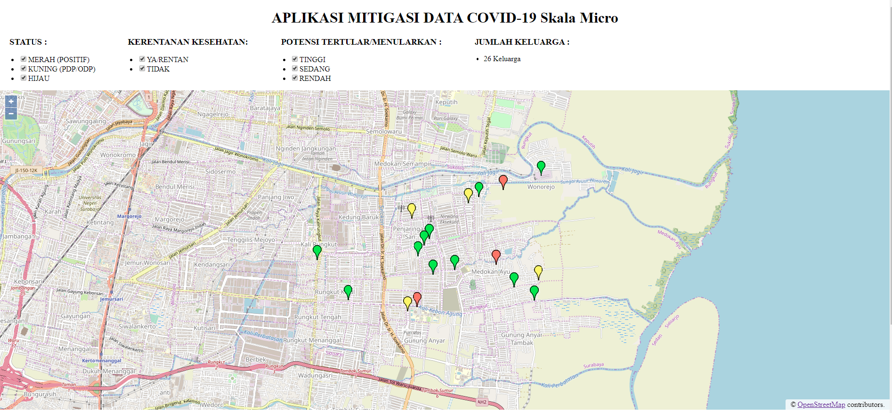

# Aplikasi Mitigasi Data COVID-19 Skala Mikro V.0.1

## LATAR BELAKANG
Tantangan terbesar dalam menghadapi COVID-19 adalah kecepatan penyebarannya, sehingga upaya pencegahan merupakan pendekatan terbaik dalam menghadapinya. Guna menunjang upaya pencegahan yang sistematis dan terukur maka dibutuhkan pemetaan lingkungan yang baik sehingga dalam mengambil tindakan dapat efektif dan efisien. Untuk melakukan ini perlu adanya kesadaran dari kita semua tentang KETERBUKAAN informasi, mari kita membangun saling pengertian terhadap segala informasi yang menunjang upaya penangana COVID-19 dengan memberikan informasi yang jujur karena penderita/pdp/odp #BUKANAIB.

Aplikasi ini merupakan aplikasi sederhana yang dibuat untuk tujuan memudahkan kita memetakan lingkungan sekitar kita pada skala mikro. Aplikasi ini dirancang sesederhana mungkin agar dapat digunakan oleh semua pihak tanpa mengalami kesulitang yang berarti.

Aplikasi ini bersifat LOKAL (Data hanya tersimpan dimana aplikasi berjalan) TIDAK membutuhkan instalasi khusus, TIDAK membutuhkan server khusus, Namun membutuhkan koneksi internet untuk menampilkan Peta/MAP

DOWNLOAD : https://codeload.github.com/fachrosi/mitigasicovid19micro/zip/master

## SIAPA PENGGUNA APLIKASI INI
1. RT/RW/DUSUN/DESA/KELURAHAN untuk memetakan warga
2. Pengelolan tempat ibadah (ex: Masjid) untuk memetakan jamaah
3. ORMAS untuk memetakan pengurus dan anggota
4. Siapa saja yang sadar akan pentingnya MITIGASI DATA

## KEBUTUHAN TEKNIS
1. Sistem Operasi Windows
2. Microsoft Excel
3. Browser : Chrome/Firefox/Edge/Opera
4. Internet

## CARA MENJALANKAN
### DOWNLOAD
1. Klik link berikut : https://codeload.github.com/fachrosi/mitigasicovid19micro/zip/master
2. Extract file .zip

### BASIS DATA : menggunakan Microsoft Excel
1. Buka file excel yang terletak di direktori/folder htdocs dengan nama : datamitigasi.xlsx
2. Isi data pada bagian : SHEET 1 (Profil Area) dan SHEET 2(Profil Keluarga/Rumah) saja
3. Simpan

### MENJALANKAN APLIKASI
1. Jalankan (klik 2x) file miniweb.exe
2. Buka Browser : Chrome/Firefox/Edge/Opera dan pastikan memiliki jaringan internet
3. Klik 2x file start.html, Jika belum berjalan masukkan alamat pada browser : http://localhost:8000
4. Aplikasi sudah berjalan

### VIDEO TUTORIAL
1. Mitigasi Covid-19 : Petakan, Rencanakan dan lakukan
Klik :  https://youtu.be/jsXVSttMJxs

2. Petunjuk Cara Membaca/Menganalisa Aplikasi Mitigasi Covid-19
Klik : https://youtu.be/r-4u3KuC4is

3. Cara Mengisi Database (Excel) Aplikasi Mitigasi Covid-19
Klik : https://youtu.be/tgRox9mKCk4

4. Cara Menjalankan/Memulai Aplikasi Mitigasi Covid-19.
Klik : https://youtu.be/_kLEcJUDjXI
